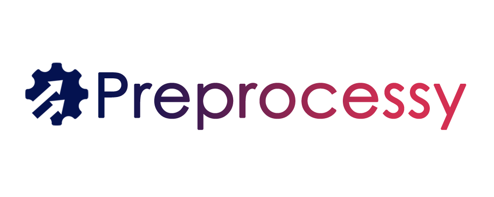

[](https://github.com/preprocessy/preprocessy/actions/workflows/workflow.yml)
[](https://gitHub.com/preprocessy/preprocessy/graphs/commit-activity)
[](https://github.com/preprocessy/preprocessy/issues)
[](https://github.com/preprocessy/preprocessy/network/members)
[](https://github.com/preprocessy/preprocessy/stargazers)
[](https://gitHub.com/preprocessy/preprocessy/graphs/contributors/)
[](https://github.com/dwyl/esta/issues)
[](https://lbesson.mit-license.org/)

Preprocessy is a framework that provides data preprocessing pipelines for machine learning. It bundles all the common preprocessing steps that are performed on the data to prepare it for machine learning models. It aims to do so in a manner that is independent of the source and type of dataset. Hence, it provides a set of functions that have been generalised to different types of data.

The pipelines themselves are composed of these functions and flexible so that the users can customise them by adding their processing functions or removing pipeline functions according to their needs. The pipelines thus provide an abstract and high-level interface to the users.

## Pipeline Structure

The pipelines are divided into 3 logical stages -

### Stage 1 - Pipeline Input

Input datasets with the following extensions are supported - `.csv, .tsv, .xls, .xlsx, .xlsm, .xlsb, .odf, .ods, .odt`

### Stage 2 - Processing

This is the major part of the pipeline consisting of processing functions. The following functions are provided out of the box as individual functions as well as a part of the pipelines -

- Handling Null Values
- Handling Outliers
- Normalisation and Scaling
- Label Encoding
- Correlation and Feature Extraction
- Training and Test set splitting

### Stage 3 - Pipeline Output

The output consists of processed dataset and pipeline parameters depending on the verbosity required.

## Contributing

Please read our [Contributing Guide](https://github.com/preprocessy/preprocessy/blob/master/CONTRIBUTING.md) before submitting a Pull Request to the project.

## Support

Feel free to contact any of the maintainers. We're happy to help!

## Roadmap

Check out our [roadmap](https://github.com/preprocessy/preprocessy/projects/1) to stay informed of the latest features released and the upcoming ones. Feel free to give us your insights!

## Documentation

The documentation can be found at [here](https://preprocessy.readthedocs.io/en/latest/). Currently, some parts of the documentation are under development. All contributions are welcome! Please see our [Contributing Guide](https://github.com/preprocessy/preprocessy/blob/master/CONTRIBUTING.md).

## Research Paper and Citations

**Preprocessy: A Customisable Data Preprocessing Framework with High-Level APIs** was presented at the **2022 7th International Conference on Data Science and Machine Learning Applications (CDMA)** and is published in **IEEE Xplore**.

Link to full paper: https://ieeexplore.ieee.org/document/9736366

If you're using Preprocessy as a part of scientific research, please use the below citations.

### Plain Text Citation

```
S. Kazi et al., "Preprocessy: A Customisable Data Preprocessing Framework with High-Level APIs," 2022 7th International Conference on Data Science and Machine Learning Applications (CDMA), 2022, pp. 206-211, doi: 10.1109/CDMA54072.2022.00039.
```


### BibTeX Citation

```
@INPROCEEDINGS{9736366,
  author={Kazi, Saif and Vakharia, Priyesh and Shah, Parth and Gupta, Riya and Tailor, Yash and Mantry, Palak and Rathod, Jash},
  booktitle={2022 7th International Conference on Data Science and Machine Learning Applications (CDMA)},
  title={Preprocessy: A Customisable Data Preprocessing Framework with High-Level APIs},
  year={2022},
  volume={},
  number={},
  pages={206-211},
  doi={10.1109/CDMA54072.2022.00039}}
```

## License

See the [LICENSE](https://github.com/preprocessy/preprocessy/blob/master/LICENSE) file for licensing information.

## Links

- Documentation: https://preprocessy.readthedocs.io/en/latest/
- Changes: https://preprocessy.readthedocs.io/en/latest/changes/
- PyPI Releases: https://pypi.org/project/preprocessy/
- Source Code: https://github.com/preprocessy/preprocessy
- Datasets: https://drive.google.com/drive/folders/1MoMHNgd6KR5A_l5PkFIcxeax7lXm72l9?usp=sharing
- Issue Tracker: https://github.com/preprocessy/preprocessy/issues
- Chat: https://discord.gg/5q2yCqqU6N
